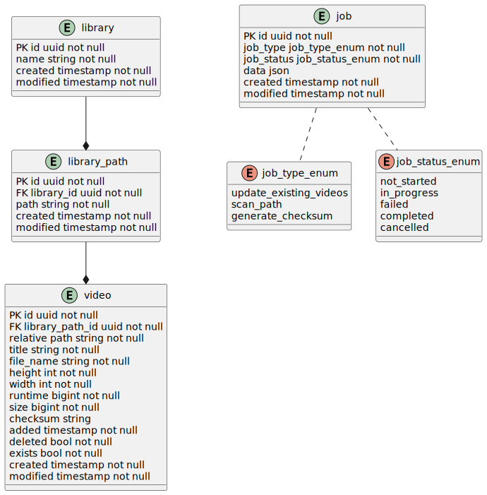

# Exorcist

Similar to ghost and poltergeist this one is written in golang

## Getting started

- Install Go
- Install Docker
- Install psql
  - Mac:
    - `brew install libpq`
    - `brew link --force libpq`
- Install ffmpeg
- Copy `templte.env` -> `.env` and fill in the details
- `docker compose up -d` to start the database
- `make run` to start the application

## Tools

### Api

[Gin](https://go.dev/doc/tutorial/web-service-gin)

### Database

#### Entity Relation Diagram



This application is using a database first approach with a sql builder instead of an ORM.
It utilizes [Jet](https://github.com/go-jet/jet)

#### Migrations

We utilize [golang-migrate](https://github.com/golang-migrate/migrate) for our migrations

Migrations run automatically when the application starts up.
It is recommended to install the cli tool for running migrations. This will allow you to run migrations from the command line without having to start up the application. [CLI migration](https://github.com/golang-migrate/migrate/tree/master/cmd/migrate)
It is also recommended that you install the [Jet CLI tool](https://github.com/go-jet/jet?tab=readme-ov-file#prerequisites) in order to update the models of the application

- Create migration: `migrate create -ext=sql -dir=./migrations <migration-name>`
- Run migrations: `./scripts/run-migrations.sh`
- Undo a migration: `./scripts/undo-migration.sh`
- Update models: `./scripts/update-models.sh`

The usual workflow would to add a migration would be:

1. Create a migration
1. Run the migrations
1. Update the models

### FFMpeg stuff

[Wrapper](https://github.com/u2takey/ffmpeg-go)

### Environment

[dotenv](https://github.com/joho/godotenv)

### Troubleshooting

- If using zsh remember to add the following to your .zshrc

  ```bash
  export GOPATH=$HOME/go  
  export PATH=$PATH:/usr/local/go/bin:$GOPATH/bin
  ```

### Diagrams

Genarating diagrams PlantUML is used.
In the docker compose file there is a plant uml server that spins up. The workspace settings uses this server to generate the UML diagrams. These generated diagrams can then be used within markdown files for documentation.

In order to generate all of the diagrams in VS Code `Ctrl+Shift+P`/`Cmd+Shift+P` `PlantUML: Export Workspace Diagrams`

I would like to find a method to do this without VS Code but for now this is the method. The reason for this is that there is no easy way to read the `.env` file into the environment and then use those variables in the settings for the project itself. This would also make it editor agnostic.

You might have to tweak the [.env](.env) file with the `PLANT_UML_PORT` to get it to run on an open port. When doing this remember to update your [settings](.vscode/settings.json)
